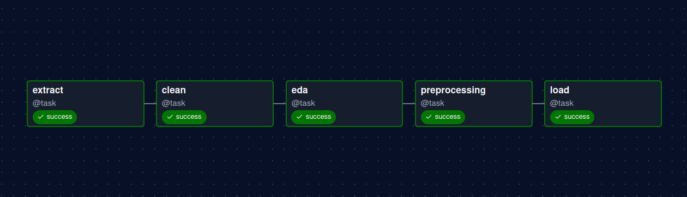

# Informe del Pipeline — TripAdvisor Restaurants

## Grafo del DAG



El pipeline está implementado como un DAG de Apache Airflow (`tripadvisor_pipeline`) compuesto por cinco tasks secuenciales. Cada task depende estrictamente de la anterior: ninguna comienza hasta que la precedente haya finalizado con éxito.

```
extract → clean → eda → preprocessing → load
```

El DAG se programa con `schedule="@daily"` y tiene `catchup=False`, por lo que solo ejecuta la última instancia pendiente sin recuperar ejecuciones pasadas. Todas las tasks están definidas con el decorador `@task` de Airflow, lo que permite encapsular cada paso como una función Python independiente sin necesidad de operadores adicionales.

---

## Descripción de cada task

### 1. `extract`

Lee el dataset fuente (`tripadvisor_european_restaurants.csv`, ~1.083.000 filas y 42 columnas) en chunks de 50.000 filas usando `pandas.read_csv` con el parámetro `chunksize`, evitando cargar el fichero completo en memoria. Cada chunk se escribe en `data/raw/raw.csv` de forma incremental. Esta task no aplica ninguna transformación: su único propósito es materializar el dataset en el sistema de ficheros local en un formato controlado.

**Salida:** `data/raw/raw.csv`

---

### 2. `clean`

Esta task realiza tres pasadas sobre el dataset para dejarlo listo para el análisis:

**Pasada 1 -> Filtrado de columnas:** Calcula el porcentaje de valores nulos de cada columna y elimina aquellas que superan el umbral configurado (`null_threshold = 0.70`). En el dataset de TripAdvisor, esto elimina columnas como `keywords` (90.8% nulos), `atmosphere` (75.8%) o `price_range` (71.9%).

**Pasada 2 -> Detección de tipos:** Sobre una muestra de 10.000 filas, clasifica cada columna en uno de los siguientes tipos: `numeric`, `numeric_categorical`, `boolean`, `categorical`, `list_json` o `dict_json`. La distinción entre `numeric` y `numeric_categorical` se basa en el número de valores únicos (umbral configurable: `numeric_categorical_threshold = 20`). Las columnas de tipo lista o diccionario JSON se extraen a ficheros separados para no distorsionar el CSV principal.

**Pasada 3 -> Transformación e imputación:** Recorre el dataset completo en chunks aplicando:
- Imputación con la mediana para columnas numéricas y con la moda para categóricas.
- Label encoding para variables categóricas y booleanas: a cada valor se le asigna un entero ordenado alfabéticamente, de forma determinista y reproducible.
- Extracción de columnas de listas/diccionarios a ficheros JSON independientes (e.g. `cuisines.json`, `top_tags.json`), con una fila por elemento para facilitar el análisis posterior.

**Salidas:** `data/processed/clean.csv`, `type_dict.json`, `encodings.json`, `processing_hints.json`, y un fichero `.json` por cada columna de tipo lista o diccionario.

---

### 3. `eda`

Realiza el análisis exploratorio de datos (EDA) sobre `clean.csv` procesando el dataset en chunks para no exceder la memoria disponible. Genera los siguientes artefactos visuales y estadísticos:

- **Variables numéricas:** Para cada columna numérica genera un histograma con curva de densidad KDE (kernel density estimation) y un boxplot superpuesto. Si la asimetría de la distribución supera 2.0, aplica una transformación logarítmica únicamente para la visualización. También calcula los valores atípicos mediante el rango intercuartílico (IQR) y la matriz de correlación de Pearson entre todas las variables numéricas.

- **Variables categóricas y booleanas:** Genera gráficos de barras mostrando las `top_n_categories` categorías más frecuentes. Para las columnas con label encoding, revierte temporalmente la codificación para mostrar los nombres originales en el eje x.

- **Variables de tipo lista:** Procesa los ficheros JSON de forma iterativa (sin cargarlos enteros en memoria) contando ocurrencias individuales y pares de co-ocurrencia por fila. Con estos datos construye matrices de co-ocurrencia en forma de heatmap para los elementos más frecuentes.

- **Matriz de dispersión:** Genera una matriz de scatter plots multivariable sobre una muestra de `scatter_sample_rows` filas para detectar relaciones entre variables numéricas.

**Salidas:** imágenes PNG organizadas en `eda/numeric/`, `eda/categorical/`, `eda/boolean/`, `eda/list_json/` y `eda/scatters/`; `numeric_stats.json` y `summary_stats.json` en `data/processed/`.

---

### 4. `preprocessing`

Prepara los datos para su uso en modelos de machine learning. También procesa en chunks para soportar datasets de gran volumen:

**Escalado numérico:** Ajusta un `StandardScaler` de scikit-learn usando `partial_fit` sobre cada chunk, acumulando media y varianza de forma incremental sin cargar todo el dataset. Una vez ajustado, aplica la transformación a cada chunk.

**Encoding categórico:** Las columnas categóricas se dividen en dos grupos según su cardinalidad (umbral: `ohe_max_cardinality = 15`):
- **One-Hot Encoding (OHE):** para columnas con pocos valores únicos, genera una columna binaria por categoría.
- **Label encoding:** para columnas de alta cardinalidad, se mantiene la codificación entera generada en el paso de limpieza.

**PCA incremental:** Aplica `IncrementalPCA` de scikit-learn sobre las columnas numéricas ya escaladas, ajustando el modelo batch a batch. El número de componentes se fija en `min(n_numeric_cols - 1, 50)`. Guarda la varianza explicada acumulada por componente en `pca_explained_variance.json`.

**Salidas:** `data/processed/preprocessed.csv`, `pca.csv`, `scaler.pkl`, `pca.pkl`, `ohe_mappings.json`, `pca_explained_variance.json`.

---

### 5. `load`

Lee `preprocessed.csv` en chunks y envía cada fila como un mensaje JSON independiente a un topic de Kafka (`restaurants`). Utiliza un `KafkaProducer` con `acks="all"` para garantizar que cada mensaje es confirmado por el broker antes de continuar. Dentro de cada chunk, los mensajes se agrupan en sub-batches (tamaño configurable: `batch_size = 500`) para controlar la presión sobre el broker y gestionar los errores de forma granular. Al finalizar, llama a `producer.flush()` para asegurar que no queda ningún mensaje pendiente en el buffer.

**Salida:** mensajes JSON en el topic `restaurants` de Kafka, listos para ser consumidos por un sistema downstream.
